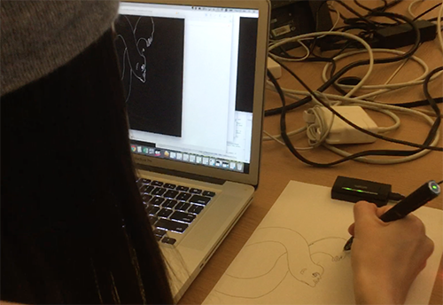

Inkling OSC Broadcaster
======

<br>
[Demo Video](https://vimeo.com/155497510)<br>
This small library broadcasts data from the [Wacom Inkling](http://inkling.wacom.com) in real time via OSC so that developers can use the data to create custom drawing applications. 

To build the project simply run ./configure from the top directory.  When the program is done compiling, plug the inkling into your USB port and run:<br>
./inkling\_broadcaster -b ipAddress:portNumber, e.g.<br>
``` ./inkling_broadcaster -b 127.0.0.1:2016```

The real time inkling data will be broadcast using OSC, and can be recieved and utilized by any other application.  See [here](https://github.com/kevinmkarol/inkling_stroke_analyzer/blob/master/src/ofApp.cpp) for example code to read the data stream.

<br>

<br>

Note that the configuration file will install multiple project dependencies for you (homebrew, automake, autoconf).  If you would rather not have the project's dependencies automatically downloaded to your computer open the script and use it as documentation for how to get the project up and running.

This code was extracted from the full GNU Inkling project originally by [Roel Janssen](https://github.com/roelj/inklingreader), which [I later expanded](https://github.com/kevinmkarol/inklingreader) to include online_mode for the Mac and OSC broadcasting.

This project also relies on these wonderfull OSC and USB HID libraries:<br>
[https://github.com/mhroth/tinyosc.git](https://github.com/mhroth/tinyosc.git)<br>
[https://github.com/signal11/hidapi.git](https://github.com/signal11/hidapi.git)

